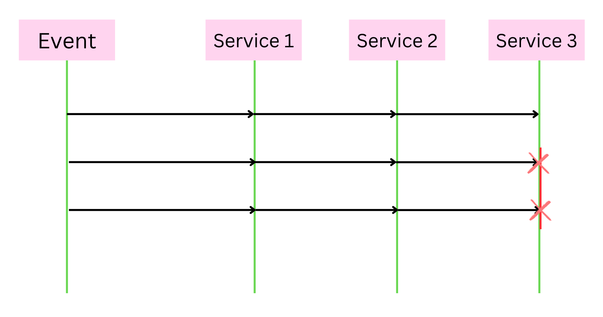

# MicroservicesWithNodeJS
Following along Udemy course for Microservices with NodeJS

## What is a microservice architecture?
Every feature of your product is independent of any other feature.

Database per feature architecture is followed.
- Not allowing any service to communicate directly to another service or their database.
- But, how would we have communication between them if we need interdependent data?
- We use a blend of Async and Sync communication.
- This new service will have its own database with the data that is only required for that particular service. And, we use "Event Bus" to keep the data on this database in sync with other services.
    - Anytime a new use is created Event Bus is notified which then notifies any concerning services. And these services then update their database.
    - This might look like an overhead but this will make our product more efficient.


## 01-project-blog
Go to each folder and run npm install.
- client
- comments
- event-bus
- moderation
- posts
- query

### Initial App Setup
- Client: Web Client
- Posts: Backend service for creating posts
- Comments: Backend service for creating comments

### Post Service
| Path | Method | Body? | Goal |
| -----|--------|-------|------|
|/posts | POST | {title: string} | Create a new Post |
|/posts | GET | - | Retrieve all posts |

### Comments Service
| Path | Method | Body? | Goal |
| -----|--------|-------|------|
|/posts/:id/comments | POST | {content: string} | Create a comment associated with the given post ID |
|/posts/:id/comments | GET | - | Retrieve all comments associated with a given post ID |

### React App (Client - Web Client)

```
App
|_ PostList
    |_ CommentList
    |_ CommentCreate
|_ PostCreate
```

The above is our ReactDOM structure.

#### Components

- We are going to see a Cors error, because we have out client running on port 3000 but requesting something on port 4000. 
    
    - We have to handle this, by installing the cors package and adding following lines to the index.js file of projects.
        ```
        const cors = require('cors');
        const app = express();
        app.use(cors());
        ```

#### Reducing number of requests
- If it was a monolith architecture, we would have been easily making this change
- But for microservice architecture, we need to scratch our head a little more.
- Way 1: Sync Communication
    - Easy to understand conceptually
    - not the best solution
    - may create architecture tree
    - no more monolith
- Way 2: Async Communication
    - Lets introduce Event Broker
    - Have create services emmit events.
    - Introduce a Query Service => which will gather data about the events generated.
    - Query service doesn't have direct relation with other services.
    - Query service will be extremely fast
    [X] Data Duplication
    [X] Harder to Understand

### What are event busses?
- Kafka, RabbitMQ are examples of out of the box event busses.
- Recieves events, publishes them to listeners.  
- We are going to make a simplest form of an event bus (nothing but an echo chamber)

### Event Bus Service
| Path | Method | Body? | Goal |
| -----|--------|-------|------|
|/events | POST | {type: string, data: eventData} | This will be the middle man between all the services and the query service |

### Query Service
- We will now, think about the query service, this is the service, which will have information about all the services needed to display a post and its comments.

| Path | Method | Body? | Goal |
| -----|--------|-------|------|
|/events | POST | {type: string, data: eventData} | On recieveing this we will store appropriete data in the data structure for minimizing the requests |
|/posts | GET | ? | This endpoint returns all the posts and the corresponding comments |

### Moderation Service
This service is required, if we are adding a comment it needs to be moderated before it is posted. 
How? It should not have certain words. So each one of the comments will have a new property: 'status' which can be "approved | pending | rejected"
Now we will add new service, Moderation service
#### Option 1:
- Comment submitted.
- emit event CommentCreated, sent by event bus to all services.
- Moderation service now, look at the content and decide if it should be approved or not.
- moderation service will emit event ModeratedEvent, sent by event bus to all services.
- Query Sevice now, look at the status and if it is approved. it will be added in data.

Pros and Cons:
- Con: Delay in submission and persistance of the comment.
- This con is severe enough to reject this option.

#### Option 2:
- This option is very similar to option 1, with slight change
- submit comment
- event emitted "commentCreated"
- processed by moderation as well as query service, we will keep the comment in default state of pending.
- But this has a problem. 
- Here a view service like query service is expected to have knowledge of business logic.

#### Option 3:
- Here we will have comments Service process ModeratedComments event. and we can send out CommentUpdated event which will be processed by query service.

- user submits comment.
- comment created event to event bus from there to all other services.
- so, we have pending comment in query.
- moderation will send out moderated comment event, and send back to all the services. 
- comment service now, process this and create generic commentUpdated event and send to query service. 
- which will now update the status of comment. (without dwelving into how and why the comment was updated).

We will go with option 3.

### Dealing with missing events

Per the above diagram when we miss some events, we dont have any way to recover them.

#### Option 1: Sync Requests
- When a new service starts, or re-starts after crashing. 
- We can send a request to all the remaining services, asking for all the data which is already present.
- Downside is it is a sync request.
- And we will have to have this endpoint in all other services.

#### Option 2: Direct DB Access
- We can have the service direct access to all the DBs.
- Downside, it will need to follow whatever DB.
- And this will be another overhead, and not something we will like.

#### Option 3: Store Event
- We can add a database for Event-Bus.
- And store all the events that have been processed.
- So, when a new service starts or restarts, we can query the event-bus 
and get all the events that it had missed.

## Section 3: Running services with Docker.

### Deployment Issues:

#### Current Setup
- The application runs locally with the following services:
  - **Post Comments Service**
  - **Query Moderation Service**
  - **Event Bus**
- Each service runs on specific ports and communicates directly via `localhost`.

#### Deploying Online
##### Option 1: Virtual Machine
- Rent a virtual machine from providers like:
  - Digital Ocean
  - AWS
  - Microsoft Azure
- Transfer the source code and run services in the same manner as locally.

#### Challenges of Scaling
1. **Increased Demand**
   - Create additional instances of services (e.g., Common Service) to handle more users.
   - Implement load balancing for incoming requests.

2. **Direct Coupling**
   - New instances require new ports (e.g., 4006, 4007).
   - The event bus needs manual updates to include these new ports.

3. **Multiple VMs**
   - If services are distributed across multiple VMs, the event bus must know each VM's IP.
   - Increases complexity with manual updates for service connectivity.

4. **Variable Demand**
   - Services may need to scale down during low-traffic periods (e.g., overnight).
   - Event bus logic must accommodate varying service availability, complicating the code.

#### Conclusion
The current direct service linking is not scalable or maintainable. We need a more robust solution that:
- Tracks all running services.
- Supports dynamic service instance creation.
- Automatically manages service health and connectivity.

#### Next Steps
- **Docker**: Introduce containerization to simplify deployment.
- **Kubernetes**: Explore orchestration for efficient management of containers.

### Why we need Docker?

#### What is Docker?
- **Containers**: Docker allows us to create isolated environments called containers.
- Each container includes everything needed to run a specific program or service.

#### Service Structure
- Create separate Docker containers for each service:
  - One for the event bus
  - One for posts
  - One for comments
- Multiple instances of a service can be run in additional containers (e.g., multiple comment services).

#### Problems Solved by Docker
1. **Environment Assumptions**:
   - Current setup relies on assumptions that:
     - Node.js and NPM are installed on the local machine.
     - Specific startup commands (e.g., `npm start`) are known and followed.

2. **Complex Setup**:
   - Starting the application requires precise knowledge of the environment and dependencies.

#### Benefits of Using Docker
- **Dependency Management**: Docker wraps all dependencies (e.g., Node.js, NPM) in the container, eliminating the need for them to be installed locally.
- **Simplicity**: Running programs becomes straightforward, not limited to Node.js but applicable to various programming languages.

### Why we need kubernetes?
#### What is Kubernetes?
- **Definition**: Kubernetes is a tool for managing and running multiple containers together.
- **Configuration Files**: Users provide configuration files that specify which containers to run.

#### Key Concepts
- **Cluster**: A set of virtual machines (VMs) that can have one or many nodes.
  - Each VM is referred to as a **node**.
  - Managed by a **master** program, which oversees the cluster's operation.

#### How Kubernetes Works
1. **Program Deployment**:
   - Users define desired configurations (e.g., number of service copies).
   - Kubernetes reads these configurations and creates the specified containers.

2. **Node Assignment**:
   - Containers are assigned to nodes in the cluster, often randomly.

3. **Communication Management**:
   - Kubernetes simplifies service communication through a common communication channel.
   - Rather than requiring direct connections between services (like the event bus to each post service), services communicate via this common channel.

#### Benefits of Kubernetes
- **Simplified Communication**: 
  - Makes it easy to send requests to services without worrying about individual node addresses.
  - Automatically routes requests to the appropriate service instances.

- **Service Management**:
  - Facilitates scaling (launching new copies of services) and overall service management.

#### Clarification on Communication
- While services do communicate with each other, Kubernetes handles this communication through a centralized system.
- This approach avoids tight coupling between services while still allowing necessary interactions.

#### Conclusion
Kubernetes is essential for managing microservices effectively, providing straightforward communication and simplifying the deployment and scaling of applications.

### Dockertize Post Service:
